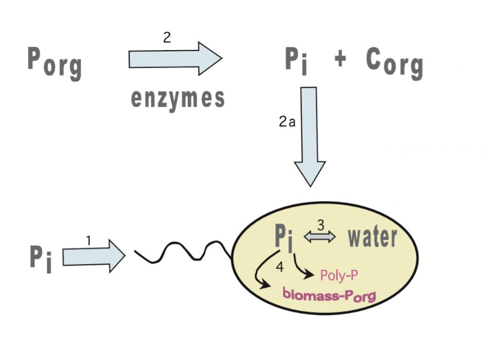

```{r "load packages", include=FALSE, message=FALSE}
#Load required packages
library(tidyverse)
library(isocyclr)
```

## Exercise 1: Develop schematic for overall system using isocyclr
From the investigations of Blake and others, 2005, we know that the phosphate scavenging enzyme alkaline phosphatase (APase) liberates phosphate from extracellular organic phosphate ($P_{org}$), imparting a kinetic fractionation effect. For our purposes, we will assume that about 50% of a cell's phosphate is taken up this way. Meanwhile, in the cell, pyrophosphatase (PPase) equilibrates phosphate with intracellular water and sets the phosphate at the equilbrium fractionation with water for that temperature. Develop a schematic for the (simplified) reaction path for the fixation of phosphate into DNA and biomass: 



Use isocyclr in the chunk below to generate a schematic with components $P_i$, $P_{org}$, $P_{cell}$, water and biomass. Be sure to include the equilibrium reaction between cell phosphate and water.

```{r, warning=FALSE}
#Create isocyclr path
#Add isotope, components and reactions here
#Display a schematic of your path 
```

## Exercise 2: Plot predicted $\delta^{18}O$ of phosphate in DNA using empirical model

Here we should recognize that since the water is an infinite reservoir of oxygen, the $P_{cell}$ is always set at the equilibrium fractionation for that temperature. Therefore, we need only consider the $\delta^{18}O_{Water}$, the temperature-dependent fractionation $\epsilon_{W-P}(T)$, and the effect of fixing phosphate into biomass, $\epsilon_{DNA-P}$. 

Develop a simplified model for the $\delta^{18}O_P$ of DNA using the temperature relation determined in Blake et, al, 2016 (temperature is in units of Kelvin): 

$$
ln(\alpha) \approx \epsilon_{P-W} \approx \delta^{18}O_P - \delta^{18}O_W \approx \frac{13.19}{T} - 0.02257
$$
Plot the expected $\delta^{18}O_{DNA}$ over the temperature interval 20 - 60 ºC. Use $\epsilon_{DNA -P}$ = -5 ‰. Assume that $\delta^{18}O_{W}$ = $\delta^{18}O_{VSMOW}$.

``` {r}
#Plot d_DNA versus temperature here
```


## Exercise 3: Growth rate

Above, we assumed that the intracellular water equilibrating with phosphate has an isotopic composition identical to VSMOW. However, recent studies suggest that up to 40% of the water reacting with phosphate inside the cell is derived from oxidation of organic matter and carries an isotopic signature of -3.5 ‰. The amount of metabolic water that is incorporated depends on the growth rate of the organism. If the microbe is growing quickly, it is generating metabolic water very quickly, and a large portion of the water that reacts with phosphate is derived from this pool. Here we will assume the growth rate, $\mu$, is dependent on temperature (in degrees C) only, using the following relation:

$$
\mu = e^{-0.01(T - T_{opt})^2} 
$$
Where $T_{opt}$ is the optimal growth temperature. Plot the growth rate, $\mu$ of a particular microbe with optimal growth temperature of 30 ºC over the temperature interval 20 - 60 ºC. 

```{r}
#Plot the growth rate over temperature here
```

## Exercise 4: Adding in metabolic water

If we further assume that the fraction of reactive water that is metabolic water, $f_{MW}$, is directly proportional to the growth rate, $\mu$, and has a maximum value of 0.4, we need only use 0.4 as the proportionality constant to derive a relation for this fraction: 

$$
f_{MW} = 0.4\cdot\mu
$$

Now we can express the final $\delta^{18}O_{DNA}$ as a function of temperature, taking into account the contribution of metabolic water based on the growth rate. Derive an equation for $\delta^{18}O_{DNA}$ and plot it. 

```{r}
#Plot d_DNA, incorporating metabolic water into the model, versus temperature here
```


